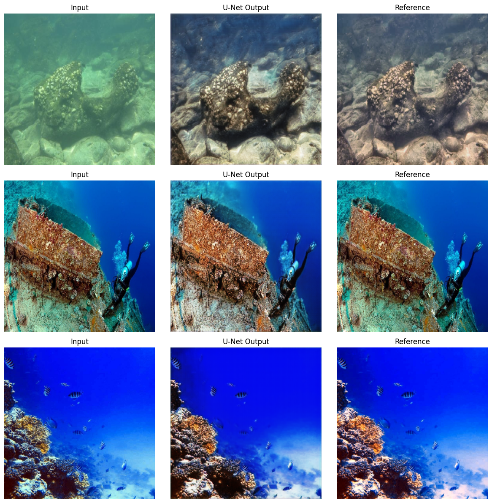

# 🌊 Underwater Image Enhancement (UIE) using Deep Learning

A deep learning project to enhance degraded underwater images using a **U-Net with Color Attention Module**, trained on the complete UIEB dataset (890 image pairs).

> Developed as part of Summer Research Internship at **NIT Karnataka, Surathkal**  
> Under the guidance of **Dr. Jidesh P.**, Department of Mathematical and Computational Sciences

---

## 📸 Sample Results

| Comparing Images |
|---|---|---|
|  |  |

---

## 🎯 Problem Statement

Underwater images suffer from severe degradation due to light absorption and scattering:

- 🔴 **Red channel** disappears first (below 3m)
- 🟠 **Orange/Yellow** disappears next (below 5m)
- 🔵 **Blue dominates** — images look hazy and color-distorted

This project restores lost colors and improves overall image quality using deep learning.

---

## 🏗️ Model Architecture

### U-Net with Color Attention Module

```
Input Image (3×256×256)
        ↓
[Encoder]
  ConvBlock(3→32)   → MaxPool
  ConvBlock(32→64)  → MaxPool
  ConvBlock(64→128) → MaxPool
        ↓
[Bottleneck + Color Attention Module]
  ConvBlock(128→256)
  Channel-wise attention → restores lost R/G/B balance
        ↓
[Decoder with Skip Connections]
  UpConv(256→128) + skip
  UpConv(128→64)  + skip
  UpConv(64→32)   + skip
        ↓
Output Image (3×256×256)
```

**Key Innovation — Color Attention Module:** Learns channel-wise importance weights to selectively restore the most degraded color channels (typically red), using a squeeze-and-excitation style mechanism:

```
Attention(F) = F ⊙ σ(W₂ · ReLU(W₁ · GAP(F)))
```

---

## 📊 Results

| Model | Dataset Size | PSNR (dB) |
|---|---|---|
| Simple CNN (Baseline) | 50 image pairs | 16.98 |
| U-Net + Color Attention | 50 image pairs | 18.27 |
| **U-Net + Color Attention (Final)** | **890 image pairs** | **22.55** ✅ |

> Training on the complete UIEB dataset improved PSNR by **+5.57 dB** over the initial baseline, demonstrating the importance of both architecture design (U-Net + attention) and dataset scale.

---

## 📦 Dataset — UIEB (Underwater Image Enhancement Benchmark)

| Detail | Info |
|---|---|
| Total Images | 890 real underwater images (paired) |
| Split | 756 train (85%) / 134 validation (15%) |
| Source | Li et al., IEEE TIP 2019 |

### Download Links
- 📥 **Raw Underwater Images:** [Google Drive](https://drive.google.com/drive/folders/1y5eUY-tg7mbUtZwAZcS57TbMhsfMch0V)
- 📥 **Reference Clean Images:** [Google Drive](https://drive.google.com/file/d/1cA-8CzajnVEL4feBRKdBxjEe6hwql6Z7/view?usp=drivesdk)
- 📄 **Original Paper:** [An Underwater Image Enhancement Benchmark Dataset and Beyond (IEEE TIP 2019)](https://ieeexplore.ieee.org/document/8917818)

---

## 🚀 Getting Started

### 1. Clone the Repository
```bash
git clone https://github.com/rathod24-code/UIE.git
cd UIE
```

### 2. Install Dependencies
```bash
pip install torch torchvision opencv-python scikit-image matplotlib numpy
```

### 3. Run on Google Colab (Recommended)
[](https://colab.research.google.com)

- Enable GPU: Runtime → Change runtime type → **T4 GPU**
- Mount Google Drive and set dataset paths
- Run all cells!

---

## 💻 Project Structure

```
UIE/
├── UIE_Training.ipynb   ← Main training notebook (Colab)
├── assets/               ← Sample result images
│   ├── degraded.png
│   ├── output.png
│   └── reference.png
└── README.md
```

---

## 🔧 Key Concepts

| Concept | Description |
|---|---|
| **CNN** | Extracts spatial features from images |
| **U-Net** | Encoder-decoder with skip connections — preserves fine details |
| **Color Attention** | Channel-wise weighting to restore lost RGB colors |
| **PSNR** | Peak Signal-to-Noise Ratio — image quality metric (higher = better) |

---

## 📈 Loss Function

```
Total Loss = MSE Loss + 0.5 × Color Loss
```

- **MSE Loss** — pixel-level accuracy
- **Color Loss** — channel-wise mean difference to fix color distortion

---

## 🛠️ Tech Stack


---

## 🗺️ Roadmap

- [x] Simple CNN baseline
- [x] U-Net with Color Attention Module
- [x] Train on full 890 image pairs — **22.55 dB PSNR achieved**
- [ ] Compare with state-of-the-art methods (FUnIE-GAN, etc.)
- [ ] Add SSIM and UCIQE evaluation metrics
- [ ] Hyperparameter tuning for further improvement

---

## 🙏 Acknowledgements

- **Dr. Jidesh P.**, NIT Karnataka — Research Supervisor
- **Neeraj Krishnan P.K.**, MACS NITK — Lab Mentor
- UIEB Dataset — Li et al., IEEE TIP 2019

---

## 📄 References

1. Li, C. et al. "An Underwater Image Enhancement Benchmark Dataset and Beyond." IEEE TIP, 2019.
2. Ronneberger et al. "U-Net: Convolutional Networks for Biomedical Image Segmentation." MICCAI, 2015.
3. Islam et al. "Fast Underwater Image Enhancement for Improved Visual Perception." IEEE RA-L, 2020.
